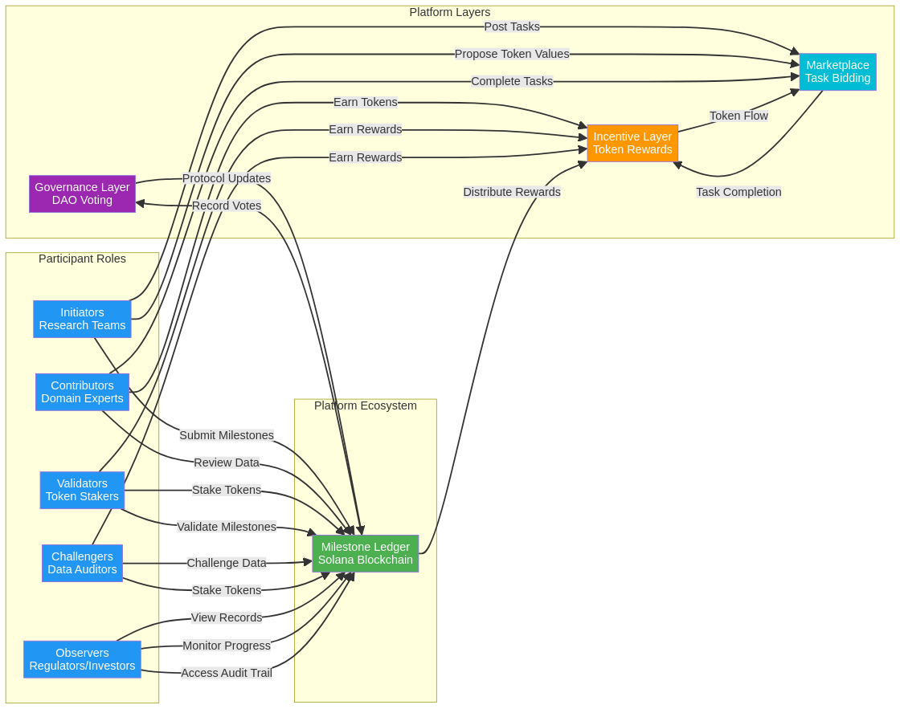
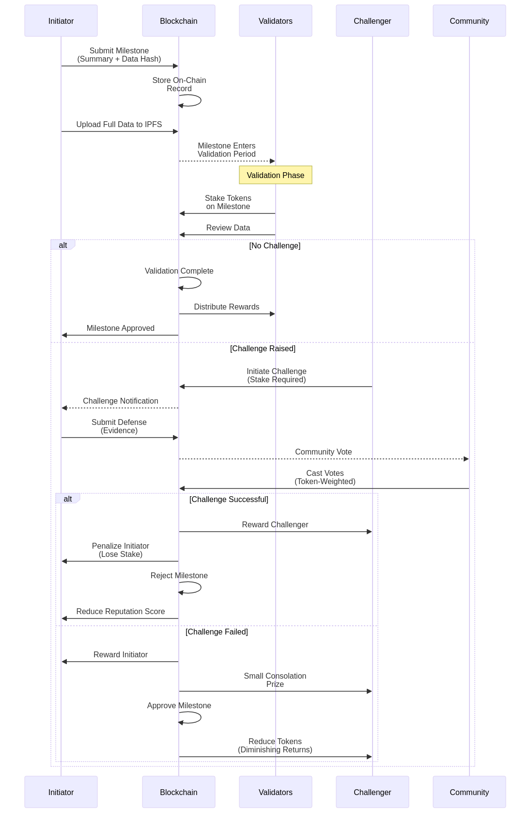
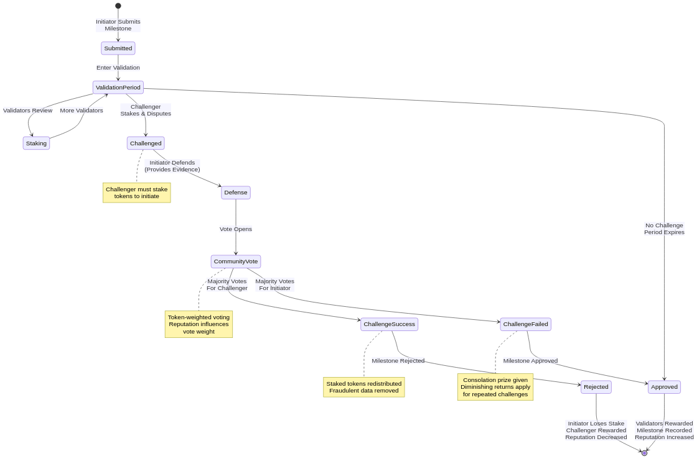
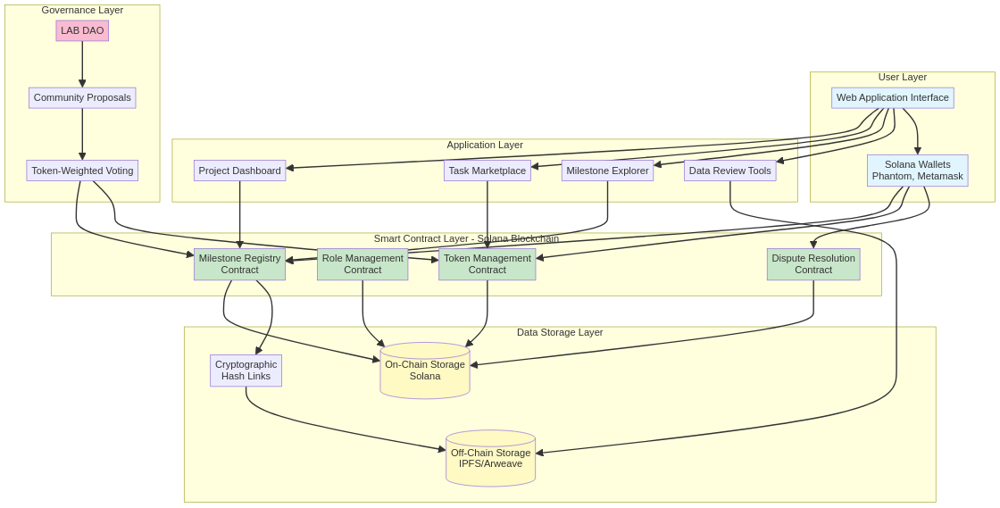
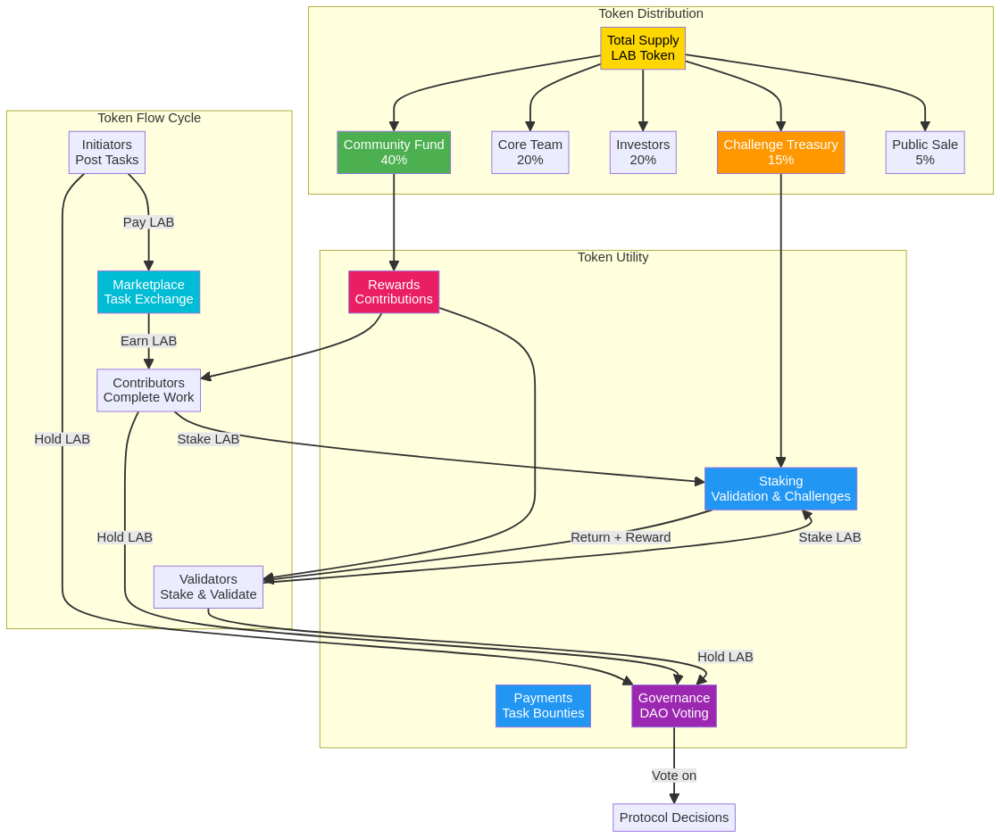
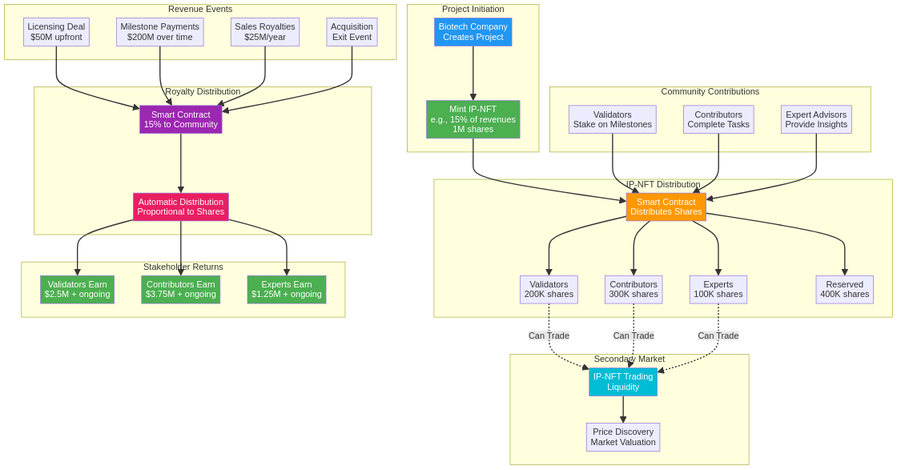
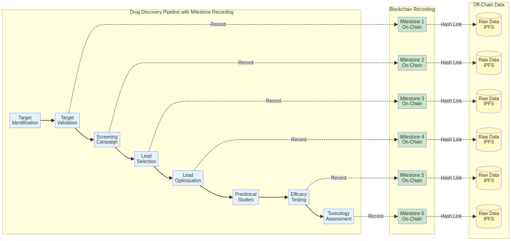
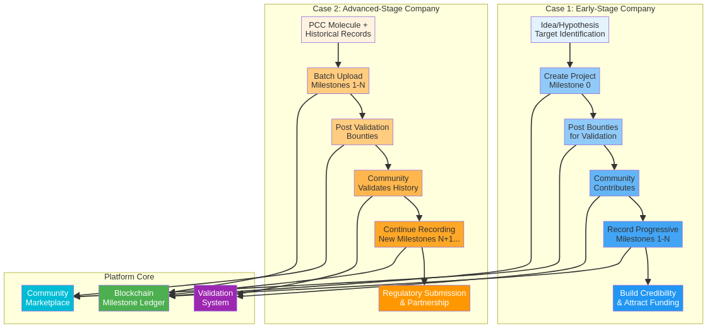

# PiperFlow: Decentralized Milestone Ledger for Collaborative Drug Discovery

**A Technical White Paper**

**By Shanghai Sai-Long Biotechnology Co., Ltd.**

**Date:** October 2025

> *Piper* is a nickname for "Pipelines" - *Flow* means the smooth process

---

## Copyright Notice

**Copyright © 2025 Shanghai Sai-Long Biotechnology Co., Ltd. All Rights Reserved.**

**License**

This work is licensed under a [Creative Commons Attribution-NonCommercial-NoDerivatives 4.0 International License (CC BY-NC-ND 4.0)](https://creativecommons.org/licenses/by-nc-nd/4.0/).

[](https://creativecommons.org/licenses/by-nc-nd/4.0/)

**You are free to:**
- Share — copy and redistribute this white paper in any medium or format

**Under the following terms:**
- **Attribution** — You must give appropriate credit to Shanghai Sai-Long Biotechnology Co., Ltd., provide a link to the license, and indicate if changes were made.
- **NonCommercial** — You may not use this white paper for commercial purposes without express written permission.
- **NoDerivatives** — You may not distribute modified versions of this white paper.

**Commercial Licensing**

For commercial licensing inquiries, partnership opportunities, or permission to create derivative works, please contact:

**Shanghai Sai-Long Biotechnology Co., Ltd.**  
Email: frankji@yalotein.com  

**Disclaimer**

This white paper is for informational purposes only and does not constitute an offer to sell or a solicitation to buy any securities, tokens, or other financial instruments. The platform and tokenomics described herein are subject to change and may require regulatory approval in certain jurisdictions. Nothing in this white paper should be construed as financial, legal, tax, or medical advice. Prospective participants should consult with appropriate professional advisors before engaging with the platform.

**Version Information**

- **Project:** PiperFlow
- **Version:** 1.0
- **Date:** October 2025
- **Status:** Draft
- **Repository:** https://github.com/yalotein/PiperFlow-WhitePaper

---


## 1. Executive Summary

The traditional drug discovery process is a long, expensive, and opaque journey, often taking over a decade and costing billions of dollars. This process is plagued by high failure rates, data integrity issues, and a lack of transparent, auditable records, making it difficult to track critical decisions and verify research outcomes. These challenges not only stifle innovation but also create significant hurdles for regulatory compliance and collaboration.

This white paper introduces a decentralized platform designed to address these critical issues by leveraging the power of the Solana blockchain. Our core concept is a **verifiable milestone ledger** that creates an immutable, time-stamped record of the entire drug development pipeline. This is combined with a robust system of **community validation** and **dynamic token incentives** to foster a more collaborative, transparent, and efficient research ecosystem.

By recording key milestones on-chain and enabling a community of experts to validate, challenge, and contribute to research, our platform offers a transformative solution. The primary benefits include enhanced data integrity, streamlined regulatory audits, accelerated innovation through open collaboration, and a more equitable distribution of incentives. This platform aims to become the decentralized operating system for collaborative drug R&D, fundamentally reshaping how new therapies are brought to life.

## 2. Background & Motivation

The pharmaceutical industry faces a persistent crisis in its research and development (R&D) pipeline. The journey from a promising scientific discovery to a market-ready drug is notoriously inefficient, characterized by several deeply entrenched challenges that hinder progress and inflate costs.

### Challenges in Drug Development

The conventional drug development process is fraught with obstacles that have become increasingly severe over time. These include:

*   **Long and Opaque Timelines:** The average time to bring a new drug to market exceeds ten years [1]. This protracted timeline is often poorly documented, making it nearly impossible to reconstruct the decision-making process for audits or knowledge transfer. Key decisions made years prior are often lost in a maze of disparate, non-standardized records.

*   **Staggering Costs and High Failure Rates:** The cost of developing a new drug is estimated to be in the billions of dollars, with a significant portion of this expenditure occurring during the high-risk clinical trial phases. Failure rates are exceptionally high, with many promising candidates failing in late-stage trials, rendering years of investment worthless [2].

*   **Data Integrity and Reproducibility Issues:** The pharmaceutical industry is grappling with a data integrity crisis. A lack of standardized procedures, inadequate record-keeping, and siloed data systems lead to inconsistent and unreliable research outcomes [3]. This not only poses a risk to patient safety but also results in regulatory citations and delays. The inability to reproduce experimental results is a major bottleneck, wasting valuable time and resources.

*   **Lack of Accountability and Trust:** The opaque nature of the drug development process fosters a lack of accountability. When a project fails, it is often difficult to pinpoint the exact cause due to poor documentation. This environment erodes trust among collaborators, investors, and regulatory bodies.

### The Opportunity for a Decentralized Solution

The emergence of blockchain technology and the Decentralized Science (DeSci) movement presents a unique opportunity to address these long-standing challenges. DeSci aims to create a more open, collaborative, and transparent scientific ecosystem by leveraging decentralized technologies [4]. By applying these principles to drug discovery, we can create a system that is not only more efficient but also more trustworthy.

A blockchain-based platform can provide an **immutable and auditable record** of every key milestone in the drug development process. This creates a single source of truth that can be accessed and verified by all stakeholders, from researchers and investors to regulators. Furthermore, by incorporating token-based incentives, we can foster a vibrant community of contributors who are rewarded for their expertise and participation, turning drug discovery into a truly collaborative effort.

This white paper outlines the architecture, tokenomics, and governance model of a platform designed to realize this vision. We believe that by combining the speed and scalability of the Solana blockchain with a robust incentive structure, we can create a new paradigm for drug discovery that is more efficient, transparent, and equitable.

### References

[1] Drug Patent Watch. (2025, September 8). *The Predictive Pipeline: Structuring Drug Development Timelines with AI-driven Patent Intelligence*. [https://www.drugpatentwatch.com/blog/the-predictive-pipeline-structuring-drug-development-timelines-with-ai-driven-patent-intelligence/](https://www.drugpatentwatch.com/blog/the-predictive-pipeline-structuring-drug-development-timelines-with-ai-driven-patent-intelligence/)

[2] Zeclinics. (2024, October 21). *Dealing With The Challenges Of Drug Discovery*. [https://www.zeclinics.com/blog/dealing-with-the-challenges-of-drug-discovery/](https://www.zeclinics.com/blog/dealing-with-the-challenges-of-drug-discovery/)

[3] FirstEigen. (2025, January 16). *Data Quality Issues Affecting the Pharmaceutical Industry*. [https://firsteigen.com/blog/data-quality-issues-affecting-the-pharmaceutical-industry-finding-a-solution/](https://firsteigen.com/blog/data-quality-issues-affecting-the-pharmaceutical-industry-finding-a-solution/)

[4] Coinbase. (n.d.). *What is decentralized science (DeSci) and how does it plan to fix academic research?*. [https://www.coinbase.com/learn/crypto-glossary/what-is-decentralized-science-desci-and-how-does-it-plan-to-fix-academic-research](https://www.coinbase.com/learn/crypto-glossary/what-is-decentralized-science-desci-and-how-does-it-plan-to-fix-academic-research)


## 3. System Overview

Our platform is a decentralized ecosystem designed to bring transparency, efficiency, and collaboration to the drug discovery process. It functions as a distributed ledger that meticulously records and validates every critical milestone in the R&D pipeline, from initial target identification to the final stages of preclinical development. By leveraging the high-throughput and low-cost capabilities of the Solana blockchain, the platform ensures that all data is immutable, time-stamped, and auditable, creating a single source of truth for all participants.

The ecosystem is designed to support a variety of participants, each with a distinct and valuable role. This role-based architecture ensures a clear separation of duties and a balanced distribution of power, fostering a collaborative and trustworthy environment.

### Key Roles

The platform accommodates the following key roles:

| Role | Description | Responsibilities |
|---|---|---|
| **Initiators** | The core research team or company that initiates a drug discovery project. | - Define project scope and key milestones.<br>- Propose initial token values for tasks.<br>- Upload initial data and research protocols. |
| **Contributors** | Scientists, researchers, and domain experts from the community. | - Review and validate milestone data.<br>- Perform specific tasks, such as data analysis or literature review.<br>- Contribute to the scientific discourse around a project. |
| **Validators** | Community members who stake tokens to vouch for the authenticity of milestones. | - Stake tokens on milestones they believe are valid.<br>- Participate in the consensus process for milestone approval.<br>- Earn rewards for successful validation. |
| **Challengers** | Any community member who questions the validity of a milestone. | - Submit a challenge with supporting evidence.<br>- Stake tokens to initiate a challenge.<br>- Earn significant rewards for successful challenges. |
| **Observers** | Regulators, investors, and other stakeholders who require visibility into the process. | - View the complete, auditable history of a project.<br>- Monitor progress and compliance.<br>- Access data for due diligence and regulatory submissions. |

### Ecosystem Overview

The platform's ecosystem can be visualized as a series of interconnected layers built on top of the Solana blockchain. At its core is the **Milestone Ledger**, which serves as the immutable record of all project activities. Surrounding this ledger are the various participants who interact with the platform through a user-friendly web interface. The **Incentive Layer** governs the flow of tokens within the ecosystem, rewarding positive contributions and penalizing malicious behavior. Finally, the **Governance Layer** provides a framework for the community to collectively manage the platform and make decisions about its future development.



**Figure 1: Platform Ecosystem - Roles and Interactions**

The diagram above illustrates how different participant roles interact with the Milestone Ledger, the Incentive Layer, the Governance Layer, and the Community Marketplace. Each role has specific responsibilities and benefits from the token-based economy.

## 4. Core Concepts

The platform is built upon four core concepts that work in synergy to create a robust and reliable system for collaborative drug discovery.

### 4.1 Milestone Recording

The fundamental component of our platform is the immutable recording of key milestones. In the context of drug discovery, a milestone represents a significant, verifiable achievement in the R&D pipeline. Examples include:

*   Successful validation of a drug target
*   Completion of a high-throughput screening campaign
*   Selection of a lead compound
*   Results of an in vivo efficacy study
*   Completion of a toxicology assessment

To balance the need for comprehensive data with the cost and efficiency of on-chain storage, we employ a hybrid approach. A concise summary of the milestone, including key data points and outcomes, is stored directly on the Solana blockchain. This on-chain record is immutable and serves as the primary point of verification. The detailed, raw data associated with the milestone (e.g., full experimental protocols, instrument readouts, and analytical data) is stored on a decentralized off-chain storage solution like IPFS or Arweave. A cryptographic hash of this off-chain data is included in the on-chain record, creating a tamper-proof link between the summary and the full dataset.

### 4.2 Milestone Validation

To ensure the integrity and accuracy of the recorded milestones, the platform incorporates a multi-faceted validation system. This system combines staking mechanisms with a "challenge and defend" model to foster a community-driven peer review process.

When a milestone is submitted, it enters a validation period during which community members can review the data. Validators can stake tokens on the milestone to signal their confidence in its authenticity. The more tokens staked on a milestone, the higher its perceived credibility. This staking mechanism provides a quick, visual indicator of community consensus.

In addition to staking, any community member can initiate a **challenge** if they believe a milestone is fraudulent or contains inaccuracies. The challenger must stake a certain number of tokens to initiate the challenge and provide evidence to support their claim. The initiator of the milestone then has an opportunity to **defend** their submission. The challenge is then put to a community vote, with the outcome determining the fate of the milestone and the staked tokens. This adversarial process incentivizes both honesty and diligence, as both parties have a financial stake in the outcome.



**Figure 2: Milestone Validation Workflow**

This sequence diagram illustrates the complete lifecycle of a milestone from submission through validation or challenge resolution.



**Figure 3: Challenge Mechanism State Machine**

The state diagram above shows the various states a milestone can transition through, including the challenge and defense process with community voting.

### 4.3 Incentive Mechanisms

A carefully designed incentive structure is crucial for fostering a vibrant and productive community. Our platform utilizes a native utility token to reward positive contributions and penalize malicious actions. The token serves several key functions:

*   **Rewards:** Contributors and validators are rewarded with tokens for their participation in the ecosystem. This includes rewards for submitting milestones, validating data, and participating in governance.

*   **Staking:** Tokens are used for staking in both the validation and challenge processes. This ensures that all participants have "skin in the game" and are financially motivated to act honestly.

*   **Dynamic Task Pricing:** The platform includes a community marketplace where the value of specific tasks (e.g., reviewing a particular dataset, performing a specific analysis) can be determined through a bidding or auction process. This allows the community to collectively decide the fair market value of different contributions.

### 4.4 Community Marketplace

The community marketplace is a central hub where all platform activities converge. It is here that initiators can post new projects and define the milestones they need to achieve. They can also create specific tasks and offer token bounties for their completion.

Contributors can browse the marketplace to find projects and tasks that align with their expertise. They can then bid on tasks, submit their work, and receive token rewards upon successful completion and validation. This marketplace creates a dynamic and efficient system for allocating resources and expertise, allowing projects to tap into a global pool of scientific talent.


## 5. Technical Architecture

The platform's architecture is designed for scalability, security, and user-friendliness. It consists of four primary layers: the Blockchain Layer, the Data Storage Layer, the Identity & Access Layer, and the Frontend Application Layer. These layers work in concert to provide a seamless and robust experience for all users.



**Figure 4: Technical System Architecture**

The architecture diagram illustrates the layered design of the platform, showing how the user interface, application layer, smart contracts, data storage, and governance components interact.

### 5.1 Blockchain Layer

The foundation of our platform is the **Solana blockchain**. We have chosen Solana for its unique combination of high throughput, low transaction costs, and rapid finality, which are essential for an application that requires frequent on-chain interactions. Solana's ability to process tens of thousands of transactions per second for a fraction of a cent makes it the ideal choice for recording a high volume of scientific milestones without incurring prohibitive costs [5].

**Smart Contracts** form the core logic of the platform and are deployed on the Solana network. These programs, written in Rust, govern all on-chain activities and ensure that the platform operates in a deterministic and transparent manner. The key responsibilities of the smart contracts include:

*   **Milestone Registry:** Managing the creation, validation, and status of all milestones.
*   **Role Management:** Enforcing the permissions and capabilities of each user role (Initiator, Contributor, etc.).
*   **Token Management:** Handling the minting, distribution, and staking of the platform's native utility token.
*   **Dispute Resolution:** Executing the logic for the challenge and defense mechanism, including the arbitration of disputes and the allocation of staked tokens.

### 5.2 Data Storage Layer

To ensure both data integrity and cost-effectiveness, we employ a hybrid data storage model. While the core metadata of each milestone is stored on-chain, the large datasets associated with scientific research are stored off-chain.

*   **Off-Chain Storage:** We utilize a decentralized storage network such as **IPFS (InterPlanetary File System)** or **Arweave** for the storage of large files, including raw experimental data, high-resolution images, and detailed research protocols. This approach ensures that the data is both persistent and censorship-resistant.

*   **On-Chain Linkage:** A cryptographic hash (e.g., a SHA-256 hash) of the off-chain data is generated and stored within the on-chain milestone record. This creates a tamper-proof link, guaranteeing that the off-chain data cannot be altered without invalidating the on-chain record. Any attempt to modify the off-chain data would result in a different hash, which would not match the one stored on the blockchain.

An example of a milestone payload schema in JSON format is provided in the Appendices.

### 5.3 Identity & Access

A robust identity and access management system is critical for ensuring the security and integrity of the platform. Our system is designed to be both flexible and secure, accommodating the diverse needs of our user base.

*   **Role-Based Access Control (RBAC):** The platform implements a strict RBAC system. Each user is assigned a specific role, and their permissions are determined by that role. For example, only an Initiator can create a new project, while only a Validator can stake tokens on a milestone. This ensures a clear separation of duties and prevents unauthorized actions.

*   **Optional KYC/KYB Layer:** For projects that involve sensitive data or require a higher level of assurance, an optional Know Your Customer (KYC) or Know Your Business (KYB) layer can be implemented. This would be particularly relevant for projects entering the later stages of clinical development, where regulatory compliance is paramount. This layer would be integrated through a third-party provider to ensure compliance with relevant regulations like GDPR and HIPAA.

### 5.4 Frontend & App Interface

The user-facing component of our platform is a modern, web-based application designed for ease of use. The frontend is built using a reactive JavaScript framework and communicates with the Solana blockchain and the off-chain storage layer through a set of secure APIs.

Key features of the user interface include:

*   **Project Dashboard:** A centralized dashboard for tracking the progress of all projects and milestones.
*   **Task Marketplace:** An interactive marketplace for bidding on and completing tasks.
*   **Data Review Tools:** Integrated tools for viewing and analyzing research data.
*   **Wallet Integration:** Seamless integration with popular Solana wallets like Phantom, allowing users to securely manage their tokens and sign transactions.
*   **Visual Milestone Explorer:** A graphical interface for exploring the history of a project and visualizing the relationships between different milestones.

## 6. Tokenomics

The economic model of the platform is designed to create a self-sustaining ecosystem that rewards valuable contributions and fosters long-term growth. The native utility token, named **LAB Token ($LAB)**, is at the heart of this model.

### 6.1 Token Design

The $LAB token is a utility token built on the Solana network. It is designed to facilitate all economic activity on the platform and is not intended to be a speculative investment. The primary use cases for the $LAB token are:

| Use Case | Description |
|---|---|
| **Staking** | Users stake $LAB to validate milestones and to initiate or defend challenges. This is the primary mechanism for ensuring data integrity. |
| **Payments** | $LAB is used to pay for tasks in the community marketplace. Initiators can post bounties in $LAB, and contributors receive payment in $LAB. |
| **Governance** | $LAB holders can participate in the platform's governance by voting on proposals related to protocol upgrades, fee structures, and other key decisions. |
| **Bounty Issuance** | Initiators use $LAB to issue bounties for the completion of specific research tasks, creating a vibrant freelance economy for scientific services. |
| **IP-NFT Minting** | Project initiators can use $LAB to mint IP-NFTs that represent fractional ownership or revenue rights to their drug discovery projects, enabling community royalty sharing. |

### 6.2 Distribution

The total supply of $LAB tokens will be fixed, and the distribution is designed to align the incentives of all stakeholders. The proposed allocation is as follows:

*   **Community & Ecosystem Fund (40%):** Reserved for rewarding contributors, validators, and for funding community-led initiatives.
*   **Core Team & Advisors (20%):** Subject to a multi-year vesting schedule to ensure long-term commitment.
*   **Early Backers & Investors (20%):** To fund the initial development and launch of the platform.
*   **Challenge & Validation Treasury (15%):** A dedicated pool of tokens to fund the rewards for the challenge and validation system.
*   **Public Sale (5%):** To ensure broad distribution and decentralization of the token.

All team and investor tokens will be subject to a vesting schedule with a cliff, ensuring that they are committed to the long-term success of the project.



**Figure 5: Token Distribution and Economic Flow**

This diagram illustrates the token distribution model and how $LAB tokens flow through the ecosystem, from initial allocation to utility functions and the circular economy between participants.

### 6.3 IP-NFT and Royalty Sharing Mechanism

One of the most innovative features of the platform is the ability for project initiators to share future revenues with the community through an **IP-NFT (Intellectual Property NFT)** and royalty distribution system. This mechanism allows biotech companies to retain ownership of their intellectual property while providing community contributors with a stake in the project's commercial success.

#### 6.3.1 How IP-NFTs Work

When a project initiator creates a new drug discovery project on the platform, they have the option to mint an **IP-NFT** that represents fractional ownership or revenue rights to the project's intellectual property. This NFT is divisible and can be distributed to community members based on their contributions.

**Key Features:**

**Fractional Ownership Model:** The IP-NFT represents a specific percentage of future royalties or licensing revenues. For example, a biotech company might allocate 10-20% of future revenues to be shared with the community.

**Contribution-Based Distribution:** IP-NFT shares are automatically distributed to community members based on their validated contributions:
- Validators who stake on successful milestones
- Contributors who complete tasks in the marketplace
- Challengers who successfully identify fraudulent data
- Experts who provide critical insights or breakthroughs

The distribution is weighted by both the quantity and quality of contributions, as measured by the Reputation Score and the value of tasks completed.

**Smart Contract Automation:** When the drug candidate generates revenue (through licensing deals, royalties, or commercialization), the smart contract automatically distributes the allocated percentage to IP-NFT holders proportional to their shares.

#### 6.3.2 Royalty Distribution Mechanisms

The platform supports multiple royalty-sharing models to accommodate different business strategies:

| Model | Description | Use Case |
|-------|-------------|----------|
| **Fixed Percentage** | Company commits to sharing a fixed percentage (e.g., 15%) of all future revenues | Early-stage projects seeking maximum community engagement |
| **Tiered Milestones** | Royalty percentage increases as the project reaches key milestones (e.g., 5% pre-IND, 10% post-Phase I, 15% post-approval) | Companies wanting to reward long-term contributors |
| **Capped Royalty** | Community receives royalties up to a maximum cap (e.g., $10M total), after which all revenues go to the company | Companies wanting to limit long-term obligations |
| **Hybrid Model** | Combination of upfront $LAB token payments + smaller ongoing royalty percentage | Balanced approach for mid-stage companies |

#### 6.3.3 Revenue Trigger Events

Royalty distributions are triggered by specific, verifiable events recorded on-chain or verified by oracles:

1. **Licensing Agreements:** When the company licenses the IP to a pharmaceutical partner, a percentage of the upfront payment and milestone payments flows to IP-NFT holders.

2. **Milestone Payments from Partners:** As the drug progresses through clinical trials, pharmaceutical partners typically pay milestone fees. A portion is automatically distributed.

3. **Royalty Payments:** Once the drug is commercialized, ongoing sales royalties are shared with the community.

4. **Acquisition Events:** If the company or the specific drug program is acquired, IP-NFT holders receive their proportional share of the acquisition price.



**Figure 8: IP-NFT and Royalty Distribution Mechanism**

This diagram illustrates the complete flow from IP-NFT minting, community contribution and share distribution, revenue events, automatic royalty distribution, and secondary market trading.

#### 6.3.4 Example Scenario: Oncology Drug with Community Royalty Sharing

**Initial Setup:**
- BioTech Startup creates a project to develop a novel cancer antibody
- They mint an IP-NFT representing 15% of future revenues
- Total IP-NFT supply: 1,000,000 shares

**Community Contributions (Year 1-3):**
- 50 validators stake tokens and earn 200,000 IP-NFT shares
- 30 contributors complete tasks and earn 300,000 IP-NFT shares
- 5 expert advisors provide critical insights and earn 100,000 IP-NFT shares
- Remaining 400,000 shares reserved for future contributors

**Revenue Event (Year 5):**
- Company licenses the drug to Big Pharma for $50M upfront + $200M in milestone payments
- 15% of $50M = $7.5M flows to IP-NFT smart contract
- Distribution to holders:
  - Validators receive: (200,000/600,000) × $7.5M = $2.5M
  - Contributors receive: (300,000/600,000) × $7.5M = $3.75M
  - Expert advisors receive: (100,000/600,000) × $7.5M = $1.25M

**Ongoing Royalties (Year 8+):**
- Drug generates $500M in annual sales
- Pharma partner pays 5% royalty to BioTech = $25M/year
- 15% of $25M = $3.75M/year distributed to IP-NFT holders
- Each holder receives proportional share based on their IP-NFT ownership

#### 6.3.5 Benefits for All Stakeholders

**For Biotech Companies:**
- Access to global talent pool without upfront cash payments
- Align incentives between company and community (everyone wins if drug succeeds)
- Reduce early-stage R&D costs by leveraging community expertise
- Build trust and transparency with investors and partners
- Retain majority ownership (typically 80-90%) while gaining community support

**For Community Contributors:**
- Opportunity to earn equity-like returns from successful drug development
- Long-term passive income from royalty distributions
- Diversification across multiple projects (can hold IP-NFTs from many drugs)
- Tradeable IP-NFT shares on secondary markets
- Direct financial stake in the success of projects they help validate

**For the Ecosystem:**
- Aligns long-term incentives (community wants projects to succeed, not just earn quick tokens)
- Attracts higher-quality contributors who see potential for significant returns
- Creates a new asset class: fractional ownership of pharmaceutical IP
- Demonstrates the power of decentralized science (DeSci) to democratize drug development

#### 6.3.6 IP-NFT Trading and Liquidity

IP-NFT shares can be traded on secondary markets, providing liquidity to early contributors:

**Primary Market:** Contributors earn IP-NFT shares through platform participation

**Secondary Market:** IP-NFT holders can sell their shares to:
- Other community members who want exposure to the project
- Investors who believe in the drug's commercial potential
- Specialized DeSci funds that invest in pharmaceutical IP-NFTs

**Price Discovery:** Market prices reflect the community's collective assessment of:
- Probability of technical success
- Commercial potential (market size, competitive landscape)
- Timeline to revenue events
- Quality of the underlying science (validated through the platform)

#### 6.3.7 Regulatory Considerations

The IP-NFT structure is designed to comply with securities regulations:

**Utility vs. Security:** IP-NFTs may be classified as securities in certain jurisdictions. The platform will:
- Implement KYC/AML for IP-NFT holders in regulated markets
- Restrict IP-NFT sales to accredited investors where required
- Work with legal counsel to structure offerings in compliance with local laws

**Transparency:** All royalty distributions are recorded on-chain, providing full transparency to regulators and token holders.

**Jurisdictional Flexibility:** Companies can choose to offer IP-NFTs only in jurisdictions with favorable regulatory frameworks (e.g., Switzerland, Singapore, certain U.S. states).

### 6.4 Reputation Score

To prevent Sybil attacks (where a single user creates multiple accounts to gain undue influence), the platform will implement a **Reputation Score**. This score is a non-transferable metric tied to a user's identity and is earned through positive contributions to the ecosystem, such as submitting valid milestones, successfully challenging fraudulent data, and actively participating in governance.

The Reputation Score will be used to weight a user's influence in certain platform activities. For example, a user with a higher Reputation Score may have their vote weighted more heavily in governance proposals or may be required to stake fewer tokens when initiating a challenge. This system ensures that the most trusted and respected members of the community have a greater say in the platform's evolution. Additionally, the Reputation Score influences the distribution of IP-NFT shares, ensuring that the most valuable contributors receive proportionally larger stakes in project success.

### References

[5] Solana. (n.d.). *Solana: The High-Speed, Low-Cost Blockchain Rival*. Evolve ETFs. [https://evolveetfs.com/wp-content/uploads/2025/04/Solana-The-High-Speed-Low-Cost-Blockchain-Rival.pdf](https://evolveetfs.com/wp-content/uploads/2025/04/Solana-The-High-Speed-Low-Cost-Blockchain-Rival.pdf)


## 7. Governance

To ensure the long-term sustainability and decentralization of the platform, we will implement a community-led governance model based on a **Decentralized Autonomous Organization (DAO)**. The DAO will empower the community to collectively make decisions about the future of the protocol, ensuring that it evolves in a way that benefits all stakeholders.

### 7.1 DAO Design

The governance of the platform will be managed by the LAB DAO. Any holder of the $LAB token will be able to participate in the governance process. The DAO will be responsible for overseeing all aspects of the protocol, including:

*   **Protocol Upgrades:** Proposing and voting on upgrades to the smart contracts.
*   **Fee Structures:** Adjusting the fees for various platform activities.
*   **Reward Policies:** Modifying the reward structure for contributors and validators.
*   **Treasury Management:** Allocating funds from the community treasury to support new initiatives.

### 7.2 Community Proposal Process

Any community member who holds a minimum threshold of $LAB tokens will be able to submit a governance proposal. The proposal will then be put to a community vote. The voting power of each member will be proportional to the number of $LAB tokens they hold, weighted by their Reputation Score. This ensures that both token ownership and positive contributions are taken into account.

A proposal will be considered successful if it meets a predefined quorum and receives a majority of the votes. Once a proposal is passed, it will be automatically executed by the platform's smart contracts, ensuring that the will of the community is carried out in a transparent and trustless manner.

### 7.3 Dispute Escalation Workflows

While the challenge and defense mechanism is designed to resolve most disputes, there may be cases where a more formal escalation process is required. The DAO will be responsible for overseeing a multi-tiered dispute resolution process. This may involve escalating a dispute to a council of elected experts or to a platform-wide vote. The goal is to provide a fair and transparent process for resolving even the most complex disputes.

## 8. Use Cases & Examples

The platform is designed to be flexible and adaptable, supporting a wide range of use cases across the drug discovery and development landscape.



**Figure 6: Drug Discovery Pipeline with Blockchain Milestone Recording**

This diagram shows how key milestones in the drug discovery process are recorded on-chain with cryptographic links to off-chain detailed data, creating an immutable audit trail from target identification through preclinical development.

### 8.1 Participation Models for Biotech Companies at Different Stages

The platform is designed to accommodate biotech companies at any stage of drug development, from early concept to advanced preclinical candidates. Each company can leverage the platform differently based on their current position in the pipeline.



**Figure 7: Participation Pathways for Early-Stage vs. Advanced-Stage Companies**

This diagram illustrates the two primary pathways for biotech companies to engage with the platform, depending on whether they are starting with just an idea or already have a preclinical candidate with historical data.

#### Case 1: Early-Stage Company with Target Hypothesis Only

**Profile:** A biotech startup has identified a promising target for treating a specific type of cancer but has not yet begun experimental validation or molecule development.

**How They Participate:**

**Initial Setup:** The company creates a new project on the platform, submitting their initial hypothesis as **Milestone 0** (Target Identification). This milestone includes:
- Target description and biological rationale
- Literature review and competitive landscape analysis
- Proposed mechanism of action
- Initial project scope and objectives

This early milestone is recorded on-chain with a timestamp, establishing priority and creating an immutable record of the original concept.

**Community Engagement:** The company can leverage the platform's marketplace to:
- Post bounties for **target validation studies** (e.g., gene knockout experiments, pathway analysis)
- Recruit domain experts to review their hypothesis and provide feedback
- Crowdsource literature reviews and competitive intelligence
- Bid for computational modeling services to predict druggability

**Progressive Milestone Recording:** As the project advances, the company records each subsequent milestone:
- **Milestone 1:** Target validation results (in vitro studies)
- **Milestone 2:** High-throughput screening campaign initiation
- **Milestone 3:** Hit identification and preliminary SAR (structure-activity relationship)
- **Milestone 4:** Lead compound selection
- And so on through the pipeline...

**Funding and Transparency:** By maintaining a transparent, validated record from day one, the company can:
- Attract investors who can verify all claims and progress in real-time
- Apply for grants with a complete, auditable research history
- Build credibility with potential pharma partners for licensing deals

**Token Economics:** The company pays $LAB tokens for community services and earns reputation as their milestones are validated. Early contributors who help validate the target or complete tasks also earn tokens and build reputation within the oncology subgroup.

**IP-NFT Option (Recommended for Early-Stage):** To maximize community engagement and access top talent without upfront cash, the company can mint an IP-NFT representing 15-20% of future revenues. This allows them to:
- Attract expert contributors who work for equity-like stakes rather than just $LAB tokens
- Build a committed community invested in the project's long-term success
- Reduce cash burn during the capital-intensive early research phase
- Demonstrate confidence in their project to potential investors

#### Case 2: Advanced-Stage Company with PCC (Preclinical Candidate) and Historical Data

**Profile:** A biotech company has already developed a Preclinical Candidate (PCC) molecule and possesses extensive historical records of all prior milestones, including target validation, screening, lead optimization, and early efficacy studies.

**How They Participate:**

**Retroactive Milestone Upload:** The company performs a **historical data migration** by uploading all previous milestones to the platform:
- **Batch Upload:** Submit milestones 1 through N (e.g., 15-20 milestones) covering the entire journey from target identification to PCC selection
- **Data Organization:** For each historical milestone, they provide:
  - Summary of key findings (stored on-chain)
  - Full experimental data, protocols, and raw results (stored on IPFS/Arweave)
  - Cryptographic hash linking on-chain and off-chain data
  - Timestamps reflecting the original dates of completion

**Validation Process:** Since these are historical milestones, the platform offers two validation pathways:

1. **Internal Validation:** The company's own team validates the data, accepting that these milestones will have lower initial credibility scores until community review occurs.

2. **Community Validation:** The company can incentivize community experts to review historical data by:
   - Posting validation bounties (paying $LAB tokens for expert review)
   - Inviting trusted validators from their network to stake on milestones
   - Allowing the community to challenge any questionable data, which actually increases trust

**Current and Future Milestones:** From the point of platform adoption forward, all new milestones are recorded in real-time:
- **Milestone N+1:** Toxicology studies (current work)
- **Milestone N+2:** Pharmacokinetics and ADME studies
- **Milestone N+3:** IND-enabling studies
- **Milestone N+4:** Regulatory submission preparation

**Strategic Benefits:**

**Regulatory Advantage:** Having a complete, immutable audit trail from target to PCC significantly streamlines regulatory submissions. The FDA and EMA can access the entire development history with verified timestamps and data integrity.

**Partnership and Licensing:** When approaching pharma companies for licensing or partnership:
- Partners can conduct due diligence directly on the platform
- All claims about the molecule's development are independently verifiable
- The challenge mechanism ensures data integrity, reducing partner risk

**IP Protection with Transparency:** The company can control access levels:
- Public milestones (e.g., target validation) for community engagement
- Restricted milestones (e.g., proprietary chemical structures) visible only to verified partners
- Time-delayed disclosure (e.g., publish detailed data 6 months after patent filing)

**Token Economics:** The company invests $LAB tokens upfront to:
- Pay for historical data validation
- Stake on their own milestones to signal confidence
- Post bounties for ongoing preclinical work

In return, they gain:
- Increased credibility and reputation score
- Access to a global talent pool for specialized tasks
- Potential token rewards if community members validate their milestones

**IP-NFT Option (Strategic for Partnerships):** Companies with a PCC can mint an IP-NFT representing 10-15% of future revenues to:
- Incentivize thorough community validation of historical data (builds trust with partners)
- Reward the community for ongoing preclinical work without diluting equity
- Create a transparent, verifiable value proposition for pharma licensing deals
- Use a **Tiered Milestone** model: lower percentage initially, increasing as the drug advances (e.g., 5% pre-IND, 10% post-Phase I, 15% post-approval)

#### Comparison Table: Participation Models

| Aspect | Early-Stage (Idea Only) | Advanced-Stage (PCC + History) |
|--------|------------------------|--------------------------------|
| **Initial Milestones** | Start from Milestone 0 (hypothesis) | Batch upload 15-20 historical milestones |
| **Primary Use** | Crowdsource validation and development work | Create auditable trail for regulatory/partnership |
| **Community Role** | Active contributors (perform experiments, analysis) | Validators and reviewers (verify historical data) |
| **Token Spending** | Pay for ongoing research tasks | Pay for historical validation + ongoing work |
| **Token Earning** | Earn as milestones are validated | Earn from community validation of quality data |
| **Transparency Level** | Fully open (build credibility) | Selective (protect IP while proving integrity) |
| **Timeline** | Build record from day 1 | Establish credibility quickly, then continue |
| **IP-NFT Strategy** | 15-20% revenue share (maximize engagement) | 10-15% tiered model (strategic partnerships) |
| **Key Benefit** | Access to talent and funding | Regulatory readiness and partnership trust |

### 8.2 Oncology Drug Pipeline - Detailed Example

Building on Case 1 above, let's examine a specific oncology startup's journey in detail. A biotechnology startup is developing a new antibody for the treatment of HER2-positive breast cancer. They use the platform to document every step of their research, from the initial validation of the antibody target to the final preclinical toxicology studies. Each milestone is recorded on-chain, creating an immutable audit trail. They use the community marketplace to outsource specific tasks, such as bioinformatic analysis and literature reviews, to a global network of experts. This allows them to accelerate their research and reduce their costs.

### 8.3 Academic Lab Milestone Funding Tracker

An academic research lab has received a grant to study a rare genetic disease. They use the platform to track their progress and report their findings to the funding agency. Each key discovery is recorded as a milestone, providing a transparent and verifiable record of their work. This allows the funding agency to monitor the project's progress in real-time and to make more informed decisions about future funding.

### 8.4 CRO Accountability Dashboard

A pharmaceutical company has outsourced a series of preclinical studies to a Contract Research Organization (CRO). They require the CRO to use the platform to document all of their work. This creates a shared, auditable record of all experiments, ensuring that the CRO is held accountable for the quality and integrity of their work. If any discrepancies arise, the challenge mechanism can be used to resolve them in a fair and transparent manner.

### 8.5 Challenge Scenario Walkthrough

1.  **Fraudulent Milestone:** A user submits a milestone with fabricated data to claim a token reward.
2.  **Challenge:** A diligent community member reviews the data and identifies inconsistencies. They initiate a challenge, staking $LAB tokens and providing evidence of the fraud.
3.  **Adjudication:** The challenge is put to a community vote. The evidence is reviewed, and the community overwhelmingly votes in favor of the challenger.
4.  **Penalty:** The fraudulent milestone is rejected. The initiator of the milestone loses their staked tokens, and their Reputation Score is significantly reduced. The challenger is rewarded with a portion of the forfeited tokens, and their Reputation Score is increased.

## 9. Regulatory and Ethical Considerations

The platform is designed to operate in a highly regulated industry, and we are committed to upholding the highest standards of regulatory compliance and ethical conduct.

### 9.1 Compliance with FDA and EMA Data Traceability Norms

The immutable and auditable nature of the platform's data records is designed to align with the stringent data traceability requirements of regulatory bodies like the U.S. Food and Drug Administration (FDA) and the European Medicines Agency (EMA). The platform's ability to provide a complete, time-stamped history of all research activities can significantly streamline the regulatory submission and approval process.

### 9.2 Ethics of Open Milestone Disclosure vs. IP Protection

We recognize the inherent tension between the desire for open, collaborative science and the need to protect valuable intellectual property (IP). Our platform is designed to be flexible, allowing project initiators to choose the level of transparency that is appropriate for their project. While some projects may choose to make all of their data public, others may opt for a more restricted model, granting access only to specific users or organizations. The platform's role-based access control system allows for granular control over data visibility, ensuring that sensitive IP is protected.

### 9.3 GDPR and HIPAA Considerations

For projects that involve sensitive patient data, compliance with regulations like the General Data Protection Regulation (GDPR) and the Health Insurance Portability and Accountability Act (HIPAA) is paramount. The platform's optional KYC/KYB layer and its ability to integrate with compliant data storage solutions will be critical for these use cases. We will work closely with legal and regulatory experts to ensure that the platform meets all necessary compliance requirements.


## 10. Roadmap

Our development roadmap is divided into four key phases, each with a clear set of objectives. This phased approach allows for iterative development and ensures that the platform is built on a solid foundation.

| Phase | Timeline | Key Objectives |
|---|---|---|
| **Phase 1: MVP Development** | Q1 2026 | - Launch of the core platform on the Solana testnet.<br>- Implementation of the milestone recording and validation system.<br>- Integration with the Phantom wallet. |
| **Phase 2: Testnet & Validator Onboarding** | Q2 2026 | - Public beta testing on the Solana testnet.<br>- Onboarding of the first cohort of validators.<br>- Refinement of the user interface based on community feedback. |
| **Phase 3: Mainnet Launch & Marketplace** | Q3 2026 | - Deployment of the platform on the Solana mainnet.<br>- Launch of the community marketplace for tasks and bounties.<br>- Implementation of the DAO governance framework. |
| **Phase 4: Pilot Projects & Ecosystem Growth** | Q4 2026 & Beyond | - Onboarding of the first pilot projects with partner labs and academic groups.<br>- Expansion of the feature set based on user needs.<br>- Continued growth of the community and ecosystem. |

## 11. Team and Advisors

*(Note: This section would typically include detailed biographies of the core team members and advisors, highlighting their expertise in blockchain technology, drug discovery, software engineering, and legal/regulatory affairs. As this is a fictional white paper, this section is intentionally left as a placeholder.)*

Our team consists of a dedicated group of experienced professionals with a shared passion for transforming the future of scientific research. Our advisory board includes leading experts from both the blockchain and pharmaceutical industries, providing us with invaluable guidance and strategic insights.

## 12. Risks and Mitigations

We have identified several potential risks that could impact the success of the platform. For each risk, we have developed a clear mitigation strategy.

| Risk | Mitigation Strategy |
|---|---|
| **Spam Challenges** | The requirement to stake tokens to initiate a challenge, combined with the Reputation Score system, will disincentivize spam. Users who repeatedly submit frivolous challenges will see their Reputation Score decrease, reducing their influence on the platform. |
| **Fraudulent Data** | The community-driven validation and challenge system is our primary defense against fraudulent data. In addition, we will explore the integration of external audit mechanisms for high-value projects. |
| **Token Volatility** | The value of the $LAB token may be subject to market volatility. To mitigate this, we will explore the use of bonding curves and the integration of stable payment options for certain platform activities. |
| **Low Community Adoption** | We will actively engage with the scientific and blockchain communities to build a vibrant and engaged user base. A portion of the ecosystem fund will be dedicated to community-building initiatives, including grants, hackathons, and educational programs. |

## 13. Conclusion

The current model for drug discovery is broken. It is a slow, expensive, and opaque process that is failing to keep pace with the rapid advancements in science and technology. We believe that a new approach is needed—one that is more transparent, collaborative, and efficient.

Our decentralized platform for collaborative drug discovery offers a bold vision for the future of pharmaceutical R&D. By leveraging the power of the Solana blockchain, a robust token-based incentive structure, and a vibrant community of experts, we can create a new operating system for drug discovery. This platform will not only accelerate the pace of innovation but also bring a new level of trust and transparency to the entire process.

We invite you to join us on this journey to reshape the future of medicine. Whether you are a scientist, a developer, an investor, or simply someone who is passionate about the future of science, there is a role for you in our community. Together, we can build a more efficient, equitable, and innovative future for drug discovery.

## 14. Appendices

### 14.1 Smart Contract Snippets

Below is an illustrative Anchor-based Solana program snippet demonstrating core flows: milestone creation, validator staking, challenge staking, and challenge resolution using a PDA escrow vault for the $LAB token. This focuses on the Milestone Registry and Dispute Resolution components described earlier.

```rust
use anchor_lang::prelude::*;
use anchor_spl::token::{self, Mint, Token, TokenAccount, Transfer};

declare_id!("BFake111111111111111111111111111111111111111");

#[program]
pub mod piperflow {
    use super::*;

    pub fn create_milestone(
        ctx: Context<CreateMilestone>,
        milestone_id: String,
        summary_hash: [u8; 32],
        offchain_uri: String,
    ) -> Result<()> {
        let milestone = &mut ctx.accounts.milestone;
        milestone.milestone_id = milestone_id;
        milestone.initiator = ctx.accounts.initiator.key();
        milestone.summary_hash = summary_hash;
        milestone.offchain_uri = offchain_uri;
        milestone.status = MilestoneStatus::Submitted;
        milestone.total_validator_stake = 0;
        milestone.total_challenger_stake = 0;
        milestone.created_at = Clock::get()?.unix_timestamp;
        Ok(())
    }

    pub fn stake_validate(ctx: Context<Stake>, amount: u64) -> Result<()> {
        require!(amount > 0, PiperflowError::ZeroAmount);
        // Transfer $LAB from staker to vault
        transfer_to_vault(
            &ctx.accounts.token_program,
            &ctx.accounts.staker_ata,
            &ctx.accounts.vault,
            &ctx.accounts.staker,
            amount,
        )?;

        let milestone = &mut ctx.accounts.milestone;
        milestone.total_validator_stake = milestone
            .total_validator_stake
            .checked_add(amount)
            .ok_or(PiperflowError::MathOverflow)?;
        // If it was submitted, move to validated when enough weight is reached (simplified)
        if milestone.status == MilestoneStatus::Submitted {
            milestone.status = MilestoneStatus::Validated;
        }
        Ok(())
    }

    pub fn stake_challenge(
        ctx: Context<Stake>,
        amount: u64,
        evidence_uri: String,
    ) -> Result<()> {
        require!(amount > 0, PiperflowError::ZeroAmount);
        transfer_to_vault(
            &ctx.accounts.token_program,
            &ctx.accounts.staker_ata,
            &ctx.accounts.vault,
            &ctx.accounts.staker,
            amount,
        )?;

        let milestone = &mut ctx.accounts.milestone;
        milestone.total_challenger_stake = milestone
            .total_challenger_stake
            .checked_add(amount)
            .ok_or(PiperflowError::MathOverflow)?;
        milestone.status = MilestoneStatus::Challenged;
        milestone.last_challenge_evidence_uri = Some(evidence_uri);
        Ok(())
    }

    // Simplified resolution: compares total stakes and sets final status.
    // In production, incorporate voting, time windows, and pro-rata distribution.
    pub fn resolve_challenge(ctx: Context<ResolveChallenge>) -> Result<()> {
        let milestone = &mut ctx.accounts.milestone;
        require!(
            milestone.status == MilestoneStatus::Challenged,
            PiperflowError::InvalidState
        );

        if milestone.total_validator_stake >= milestone.total_challenger_stake {
            milestone.status = MilestoneStatus::Validated;
        } else {
            milestone.status = MilestoneStatus::Rejected;
        }
        // Escrow distribution to winners omitted for brevity.
        Ok(())
    }
}

fn transfer_to_vault(
    token_program: &Program<Token>,
    from: &Account<TokenAccount>,
    to: &Account<TokenAccount>,
    authority: &Signer,
    amount: u64,
) -> Result<()> {
    let cpi_accounts = Transfer {
        from: from.to_account_info(),
        to: to.to_account_info(),
        authority: authority.to_account_info(),
    };
    let cpi_ctx = CpiContext::new(token_program.to_account_info(), cpi_accounts);
    token::transfer(cpi_ctx, amount)
}

#[derive(Accounts)]
pub struct CreateMilestone<'info> {
    #[account(mut)]
    pub initiator: Signer<'info>,
    #[account(
        init,
        payer = initiator,
        space = 8 + Milestone::MAX_SIZE,
        seeds = [b"milestone", initiator.key().as_ref(), milestone_id_seed(&milestone_id())?.as_ref()],
        bump
    )]
    pub milestone: Account<'info, Milestone>,
    #[account(
        init,
        payer = initiator,
        token::mint = lab_mint,
        token::authority = vault_authority,
        seeds = [b"vault", milestone.key().as_ref()],
        bump
    )]
    pub vault: Account<'info, TokenAccount>,
    /// CHECK: PDA authority for the vault
    #[account(seeds = [b"vault_auth", milestone.key().as_ref()], bump)]
    pub vault_authority: UncheckedAccount<'info>,
    pub lab_mint: Account<'info, Mint>,
    pub token_program: Program<'info, Token>,
    pub system_program: Program<'info, System>,
}

#[derive(Accounts)]
pub struct Stake<'info> {
    #[account(mut)]
    pub staker: Signer<'info>,
    #[account(mut)]
    pub milestone: Account<'info, Milestone>,
    #[account(mut, seeds = [b"vault", milestone.key().as_ref()], bump)]
    pub vault: Account<'info, TokenAccount>,
    #[account(mut, constraint = staker_ata.mint == lab_mint.key())]
    pub staker_ata: Account<'info, TokenAccount>,
    pub lab_mint: Account<'info, Mint>,
    pub token_program: Program<'info, Token>,
}

#[derive(Accounts)]
pub struct ResolveChallenge<'info> {
    pub resolver: Signer<'info>,
    #[account(mut)]
    pub milestone: Account<'info, Milestone>,
}

#[account]
pub struct Milestone {
    pub milestone_id: String,
    pub initiator: Pubkey,
    pub summary_hash: [u8; 32],
    pub offchain_uri: String,
    pub status: MilestoneStatus,
    pub total_validator_stake: u64,
    pub total_challenger_stake: u64,
    pub last_challenge_evidence_uri: Option<String>,
    pub created_at: i64,
}

impl Milestone {
    pub const MAX_SIZE: usize =
        4 + 64 + // milestone_id (vec, cap example)
        32 +      // initiator
        32 +      // summary_hash
        4 + 200 + // offchain_uri (vec, cap example)
        1 +       // status
        8 + 8 +   // stakes
        1 + 4 + 256 + // option<evidence_uri>
        8;        // created_at
}

#[derive(AnchorSerialize, AnchorDeserialize, Clone, PartialEq, Eq)]
pub enum MilestoneStatus {
    Submitted,
    Validated,
    Challenged,
    Rejected,
}

#[error_code]
pub enum PiperflowError {
    #[msg("Amount must be greater than zero")]
    ZeroAmount,
    #[msg("Math overflow")]
    MathOverflow,
    #[msg("Invalid state for operation")]
    InvalidState,
}

// Helper for PDA seed from milestone_id string
fn milestone_id_seed() -> Result<Vec<u8>> {
    // In a full implementation, sanitize and bound the size.
    Ok(b"mid".to_vec())
}
```

Notes:
- The vault PDA escrows $LAB stakes; distribution logic is omitted for brevity and should be implemented with pro-rata payouts and time-locked resolution windows.
- Production code should add bounds checks on string sizes, project linkage, replay protection, event emission, and governance-controlled parameters for minimum stakes and resolution rules.

### 14.2 Milestone JSON Schema Example

```json
{
  "milestoneId": "M12345",
  "projectId": "P67890",
  "title": "Lead Compound Selection for Project X",
  "summary": "Compound XYZ was selected as the lead candidate based on its superior efficacy and safety profile in preclinical models.",
  "timestamp": "2025-10-21T14:30:00Z",
  "initiator": "5f...a1",
  "dataHash": "Qm...Zk",
  "status": "Validated",
  "validationHistory": [
    {
      "validator": "7d...b3",
      "timestamp": "2025-10-22T10:00:00Z",
      "stakedAmount": 1000
    }
  ]
}
```

### 14.3 Glossary of Terms

*   **DAO (Decentralized Autonomous Organization):** An organization represented by rules encoded as a computer program that is transparent, controlled by the organization members and not influenced by a central government.
*   **DeSci (Decentralized Science):** A movement that aims to build a more open, collaborative, and transparent scientific ecosystem using decentralized technologies.
*   **Milestone:** A significant, verifiable achievement in the drug discovery and development pipeline.
*   **Reputation Score:** A non-transferable metric that represents a user's trustworthiness and influence on the platform.
*   **Solana:** A high-performance blockchain supporting builders around the world creating crypto apps that scale today.
*   **Staking:** The process of locking up cryptocurrency holdings in order to obtain rewards or voting power.

### 14.4 References to Academic and Regulatory Literature

*(Note: This section would include a comprehensive list of all academic papers, regulatory guidelines, and other literature referenced throughout the white paper.)*

